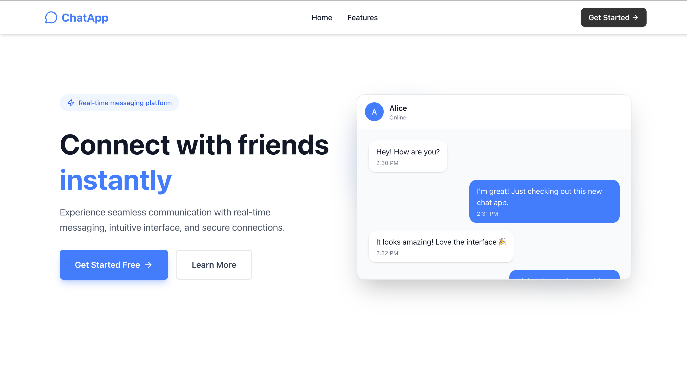

# ChatApp - Real-time Messaging Platform

A modern, real-time chat application built with Next.js, Socket.IO, and MongoDB. Experience seamless communication with instant messaging, intuitive interface, and secure connections.



## 📋 Table of Contents

- [Introduction](#introduction)
- [Features](#features)
- [Technologies Used](#technologies-used)
- [Getting Started](#getting-started)
  - [Prerequisites](#prerequisites)
  - [Installation](#installation)
  - [Environment Variables](#environment-variables)
  - [Running the Application](#running-the-application)
- [Project Structure](#project-structure)
- [Contributing](#contributing)
- [Acknowledgements](#acknowledgements)

## Introduction

ChatApp is a full-stack real-time messaging application that allows users to connect with friends and chat instantly. Built with modern web technologies, it provides a seamless user experience with features like real-time message delivery, friend management, and a clean, responsive interface.

### Key Highlights:
- ⚡ **Real-time messaging** with WebSocket technology
- 🔐 **Secure authentication** with NextAuth.js
- 👥 **Friend management** system
- 📱 **Fully responsive** design
- 🎨 **Clean and modern** UI
- 🚀 **Optimized performance** with message caching

## Features

- **Real-time Messaging**: Instant message delivery using Socket.IO
- **User Authentication**: Secure login and signup with NextAuth.js
- **Friend System**: Add, remove, and manage friends
- **User Search**: Find and connect with other users
- **Message History**: Persistent chat history stored in MongoDB
- **Online Status**: See when friends are online
- **Responsive Design**: Works seamlessly on desktop and mobile devices
- **Message Caching**: Smart caching for faster chat loading
- **Typing Indicators**: Real-time typing status (coming soon)
- **Read Receipts**: Message read status (coming soon)

## Technologies Used

### Frontend
- **[Next.js 14](https://nextjs.org/)** - React framework with App Router
- **[React 18](https://react.dev/)** - UI library
- **[TypeScript](https://www.typescriptlang.org/)** - Type-safe JavaScript
- **[Tailwind CSS](https://tailwindcss.com/)** - Utility-first CSS framework
- **[NextAuth.js](https://next-auth.js.org/)** - Authentication for Next.js
- **[Socket.IO Client](https://socket.io/)** - Real-time WebSocket communication
- **[Lucide React](https://lucide.dev/)** - Beautiful icon library
- **[Axios](https://axios-http.com/)** - HTTP client

### Backend
- **[Node.js](https://nodejs.org/)** - JavaScript runtime
- **[Express.js](https://expressjs.com/)** - Web application framework
- **[Socket.IO](https://socket.io/)** - Real-time bidirectional communication
- **[MongoDB](https://www.mongodb.com/)** - NoSQL database
- **[Mongoose](https://mongoosejs.com/)** - MongoDB object modeling

### Development Tools
- **[ESLint](https://eslint.org/)** - Code linting
- **[Prettier](https://prettier.io/)** - Code formatting
- **[Git](https://git-scm.com/)** - Version control

## Getting Started

### Prerequisites

Before you begin, ensure you have the following installed:
- **Node.js** (v18 or higher)
- **npm** or **yarn** or **pnpm**
- **MongoDB** (local installation or MongoDB Atlas account)
- **Git**

### Installation

1. **Clone the repository**
```bash
   git clone https://github.com/yourusername/chatapp.git
   cd chatapp
```

2. **Install frontend dependencies**
```bash
   cd client
   npm install
```

3. **Install backend dependencies**
```bash
   cd ../server
   npm install
```

### Environment Variables

#### Frontend (.env.local)
Create a `.env.local` file in the `client` directory:
```env
# NextAuth Configuration
NEXTAUTH_URL=http://localhost:3000
NEXTAUTH_SECRET=your-secret-key-here

# API Configuration
NEXT_PUBLIC_API_URL=http://localhost:8000
NEXT_PUBLIC_SOCKET_URL=http://localhost:8000

```

#### Backend (.env)
Create a `.env` file in the `server` directory:
```env
# Server Configuration
PORT=8000
NODE_ENV=development

# Database
MONGODB_URI=your_db_uri

# CORS
CORS_ORIGIN=http://localhost:3000

# JWT Secret (if using custom auth)
JWT_SECRET=your-jwt-secret-here
```

### Running the Application

1. **Start MongoDB**
```bash
   # If using local MongoDB
   mongod
```

2. **Start the backend server**
```bash
   cd server
   npm run dev
```
   The server will start on `http://localhost:8000`

3. **Start the frontend development server**
```bash
   cd client
   npm run dev
```
   The application will open at `http://localhost:3000`

4. **Access the application**
   - Open your browser and navigate to `http://localhost:3000`
   - Sign up for a new account or login
   - Start chatting with friends!

## Project Structure
```
chatapp/
├── client/                # Frontend Next.js application
│   ├── app/              # Next.js app directory
│   ├── api/              # NextAuth config
│   │   ├── auth/         # Authentication pages
│   │   ├── chat/         # Chat interface
│   │   └── page.tsx      # Landing page
│   ├── components/       # React components
│   │   ├── chat/         # Chat-related components
│   │   ├── main/         # Home page components
│   │   └── ui/           # Reusable UI components
│   ├── context/          # React context providers
│   ├── public/           # Public images and files
│   ├── types/            # TypeScript type definitions
│   ├── utils/            # Utility functions
│   └── public/           # Static assets
│
├── server/               # Backend Node.js application
│   ├── config/           # Configuration files
│   ├── controllers/      # Route controllers
│   ├── middleware/       # Express middleware
│   ├── model/            # Mongoose models
│   ├── route/            # API routes
│   ├── service/          # Business logic
│   └── index.js          # Server entry point
│
└── README.md
```

## Contributing

Contributions are welcome! Please follow these steps:

1. Fork the repository
2. Create a new branch (`git checkout -b feature/amazing-feature`)
3. Commit your changes (`git commit -m 'Add some amazing feature'`)
4. Push to the branch (`git push origin feature/amazing-feature`)
5. Open a Pull Request

## Acknowledgements

- [Next.js Documentation](https://nextjs.org/docs) - Comprehensive Next.js guides
- [Socket.IO Documentation](https://socket.io/docs/) - Real-time communication tutorials
- [Tailwind CSS](https://tailwindcss.com/) - Beautiful UI styling
- [Lucide Icons](https://lucide.dev/) - Clean and consistent icons
- [MongoDB Documentation](https://docs.mongodb.com/) - Database guides and best practices
- [Vercel](https://vercel.com/) - Deployment platform for Next.js applications
- [Claude AI](https://claude.ai/) - AI assistance for development

---

<div align="center">
  <p>Made with ❤️ by Your Shivam</p>
  <p>
    <a href="https://github.com/SHIVAM-KUMAR-59">GitHub</a> •
    <a href="https://x.com/ShivamK75854391">Twitter</a> •
    <a href="https://www.linkedin.com/in/shivam-kumar-946614277">LinkedIn</a>
  </p>
</div>